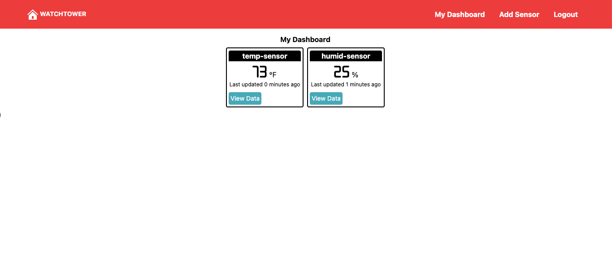

 # Watchtower

  ## Table of Contents

  * [Description](#description)  
  * [Badges](#badges)  
  * [License](#license)  

  ## Description

  Watchtower allows hobbyists to create custom sensors to monitor their home envrionments and view the data online.
  
  
  
  
  
  ## Usage
    
  ### Follow these instructions to use the project
  - To use Watchtower, please navigate to https://safe-taiga-31978.herokuapp.com/ and create an account. To add sensor data, set up your sensors to upload data via url to the endpoint "https://safe-taiga-31978.herokuapp.com/data/dump?sensorName=humid-sensor&measurement=25&units=%" substituting in your sensor name, measurements, and units as desired.
  
  
  ## Badges

  
  
  
   
  

  
  ## License
  MIT License

  Copyright (c) 2021 zackaryanderson
    
  Permission is hereby granted, free of charge, to any person obtaining a copy
  of this software and associated documentation files (the "Software"), to deal
  in the Software without restriction, including without limitation the rights
  to use, copy, modify, merge, publish, distribute, sublicense, and/or sell    copies of the Software, and to permit persons to whom the Software is
  furnished to do so, subject to the following conditions:
    
  The above copyright notice and this permission notice shall be included in all
  copies or substantial portions of the Software.
    
  THE SOFTWARE IS PROVIDED "AS IS", WITHOUT WARRANTY OF ANY KIND, EXPRESS OR
  IMPLIED, INCLUDING BUT NOT LIMITED TO THE WARRANTIES OF MERCHANTABILITY,
  FITNESS FOR A PARTICULAR PURPOSE AND NONINFRINGEMENT. IN NO EVENT SHALL THE
  AUTHORS OR COPYRIGHT HOLDERS BE LIABLE FOR ANY CLAIM, DAMAGES OR OTHER
  LIABILITY, WHETHER IN AN ACTION OF CONTRACT, TORT OR OTHERWISE, ARISING FROM,
  OUT OF OR IN CONNECTION WITH THE SOFTWARE OR THE USE OR OTHER DEALINGS IN THE
  SOFTWARE.
    

  

  ### _MADE WITH README GENERATOR_
  
  
        
